🌸 Flower Shop App

A modern eCommerce Flutter application for buying and selling beautiful flowers 💐.
Built with Clean Architecture and scalable state management.

📖 Overview

This app allows users to browse a variety of modern flowers, add them to cart, and complete purchases.
It focuses on clean UI, smooth performance, and a scalable architecture.

✨ Features

- 🔐 User Authentication (Login / Signup)
- 🌸 Browse modern flower collections
- 🛒 Add to Cart & manage items
- ❤️ Wishlist (Favorites)
- 👤 User Profile management
- 🔎 Search functionality
- ⚡ Clean Architecture + Cubit (Bloc)

📸 Screenshots 

  
  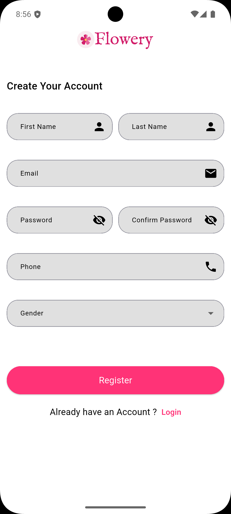
  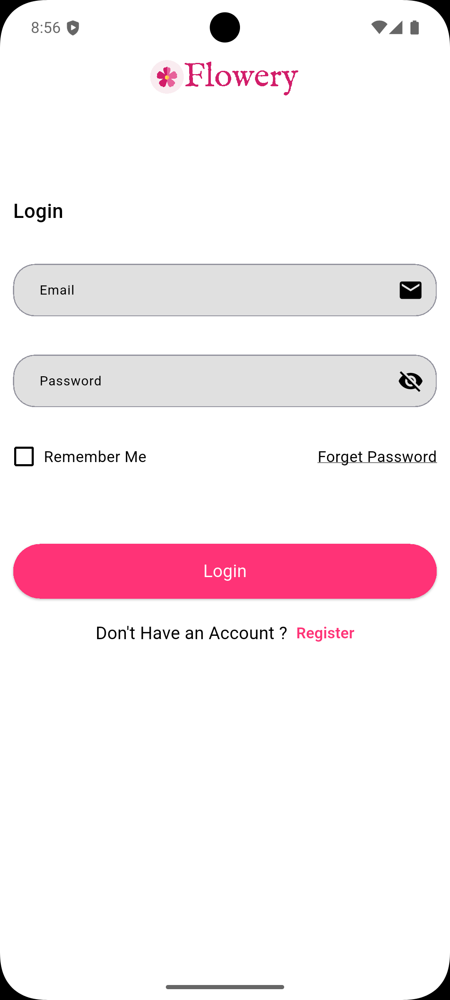
  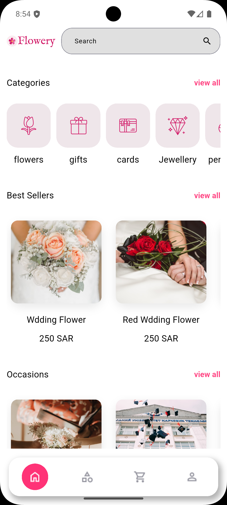
  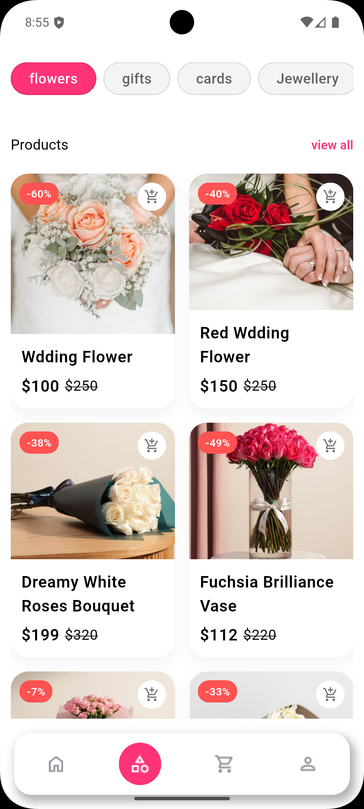
  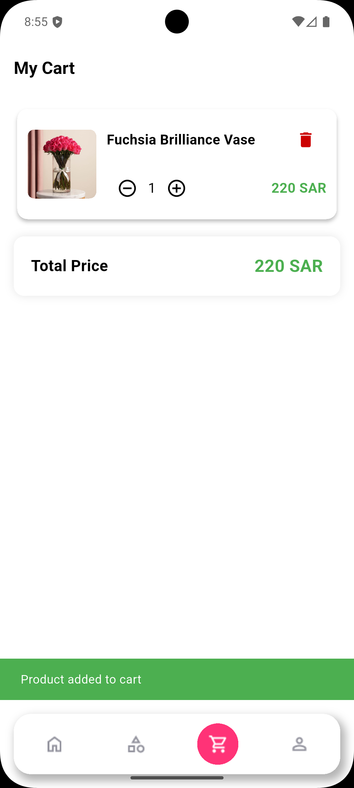
  
  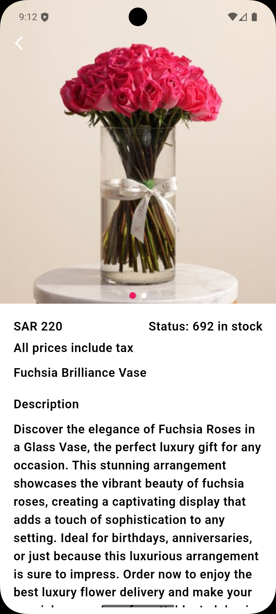

  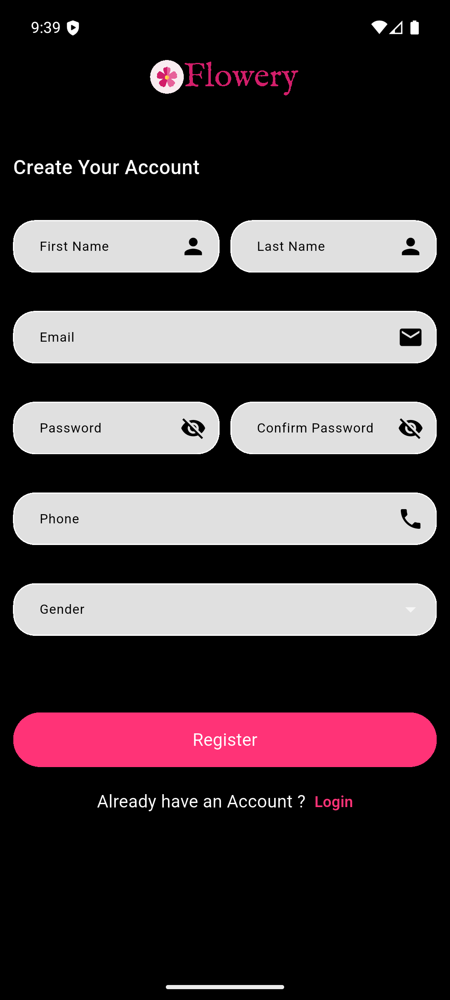
  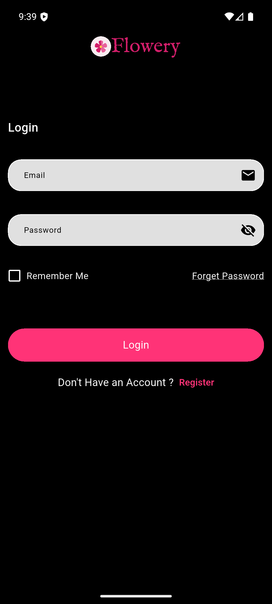
  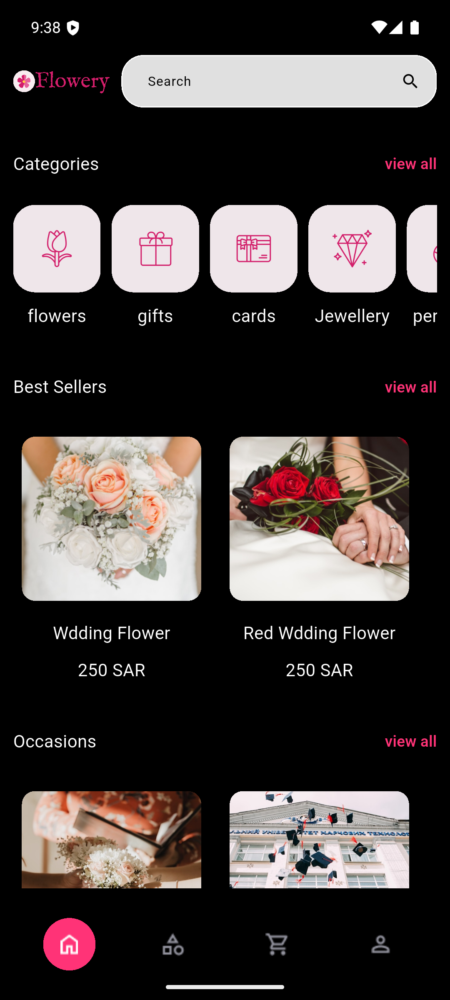
  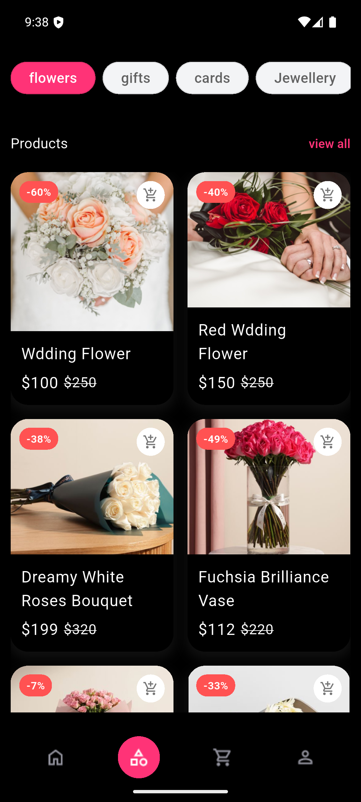
  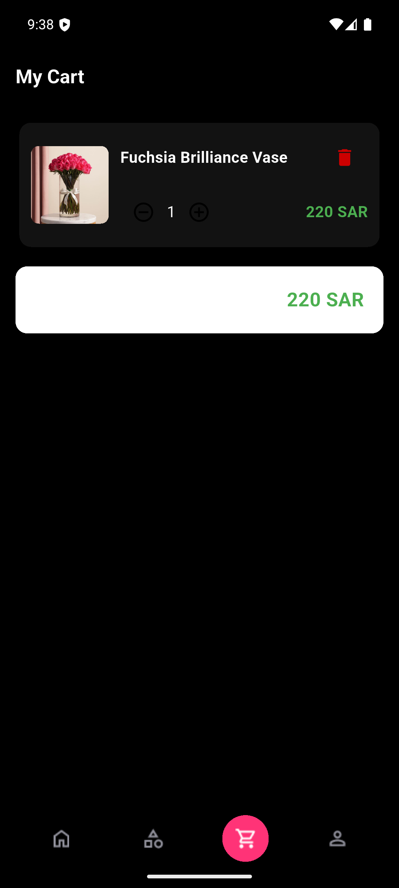
  
  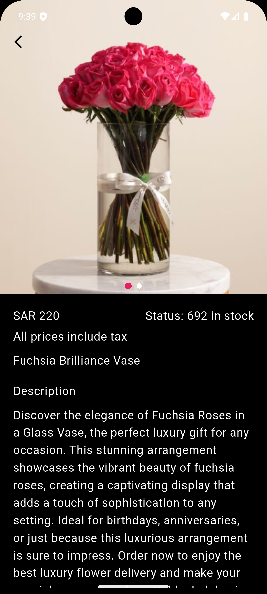

🛠️ Tech Stack

- Flutter
- Dart
- REST APIs
- Cubit (Bloc)
- Storage
- Clean Architecture

## 🎥 Demo
👉 [Watch App Demo](https://drive.google.com/file/d/1vF6t-HYLmyq16E2P7xtNVr0GMV5y1eei/view)
